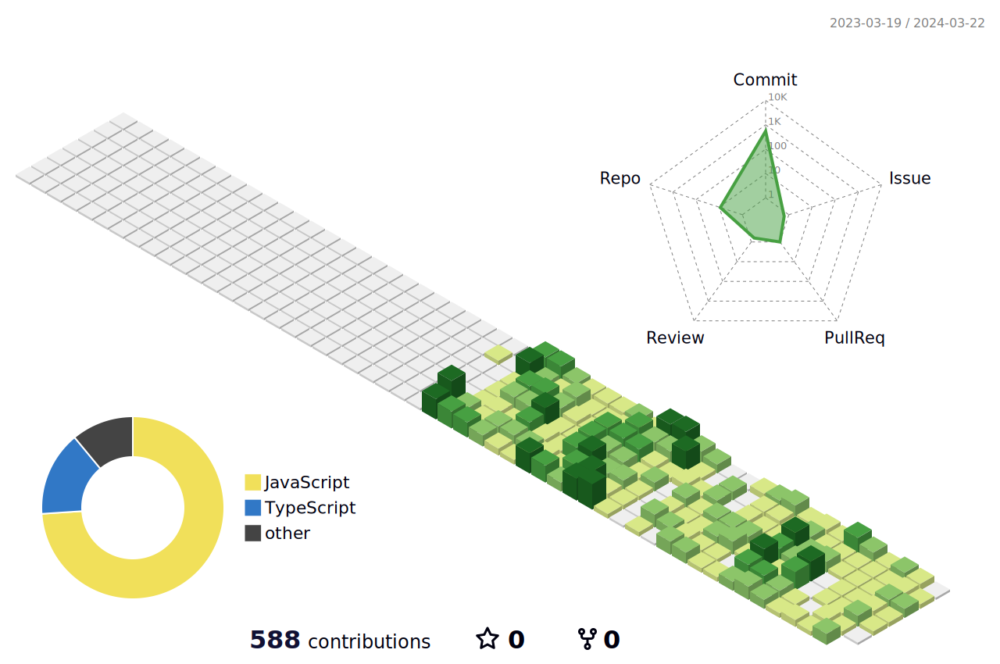

[](#)

<h3>👨‍💻&nbsp;About Me</h3>

- 🎓&nbsp;Bachelor Of Science In Computer Engineering
- 🙌&nbsp;Coding And Drinking Coffee Are My Happy
- 🏫&nbsp;I'm Learning NodeJS

<h3>⚙️&nbsp;Tech Stack</h3>

<div align = "center">
  

<br />

</div>


<h2>⚡️ &nbsp; Github Stats</h2>
<p align = "center">
  
  

</p>

<p align = "center">
  
</p>

  
<!--START_SECTION:waka-->


**I'm an Early 🐤** 

```text
🌞 Morning                38 commits          ██░░░░░░░░░░░░░░░░░░░░░░░   09.77 % 
🌆 Daytime                164 commits         ███████████░░░░░░░░░░░░░░   42.16 % 
🌃 Evening                159 commits         ██████████░░░░░░░░░░░░░░░   40.87 % 
🌙 Night                  28 commits          ██░░░░░░░░░░░░░░░░░░░░░░░   07.20 % 
```
📅 **I'm Most Productive on Saturday** 

```text
Monday                   57 commits          ████░░░░░░░░░░░░░░░░░░░░░   14.65 % 
Tuesday                  55 commits          ████░░░░░░░░░░░░░░░░░░░░░   14.14 % 
Wednesday                53 commits          ███░░░░░░░░░░░░░░░░░░░░░░   13.62 % 
Thursday                 51 commits          ███░░░░░░░░░░░░░░░░░░░░░░   13.11 % 
Friday                   51 commits          ███░░░░░░░░░░░░░░░░░░░░░░   13.11 % 
Saturday                 65 commits          ████░░░░░░░░░░░░░░░░░░░░░   16.71 % 
Sunday                   57 commits          ████░░░░░░░░░░░░░░░░░░░░░   14.65 % 
```


📊 **This Week I Spent My Time On** 

```text
🕑︎ Time Zone: Asia/Tehran

💬 Programming Languages: 
JavaScript               16 hrs 54 mins      █████████████████████░░░░   83.01 % 
TypeScript               1 hr 51 mins        ██░░░░░░░░░░░░░░░░░░░░░░░   09.10 % 
Bash                     1 hr 1 min          █░░░░░░░░░░░░░░░░░░░░░░░░   05.00 % 
EJS                      24 mins             █░░░░░░░░░░░░░░░░░░░░░░░░   02.03 % 
JSON                     6 mins              ░░░░░░░░░░░░░░░░░░░░░░░░░   00.54 % 

🔥 Editors: 
VS Code                  20 hrs 22 mins      █████████████████████████   100.00 % 

🐱‍💻 Projects: 
robot-digikala           9 hrs 26 mins       ████████████░░░░░░░░░░░░░   46.35 % 
refactor robot digikala  7 hrs 2 mins        █████████░░░░░░░░░░░░░░░░   34.54 % 
product-management-nodejs3 hrs 7 mins        ████░░░░░░░░░░░░░░░░░░░░░   15.31 % 
music-backend            26 mins             █░░░░░░░░░░░░░░░░░░░░░░░░   02.18 % 
robot                    14 mins             ░░░░░░░░░░░░░░░░░░░░░░░░░   01.15 % 

💻 Operating System: 
Windows                  20 hrs 22 mins      █████████████████████████   100.00 % 
```


<!--END_SECTION:waka-->
