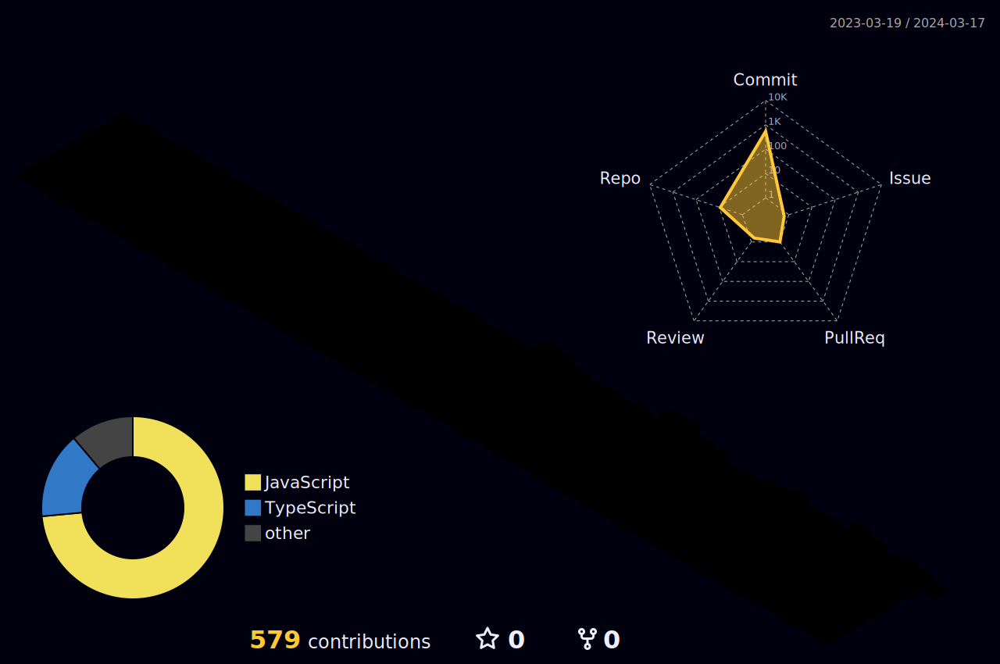

[](#)

<h3>👨‍💻&nbsp;About Me</h3>

- 🎓&nbsp;Bachelor Of Science In Computer Engineering
- 🙌&nbsp;Coding And Drinking Coffee Are My Happy
- 🏫&nbsp;I'm Learning NodeJS

<h3>⚙️&nbsp;Tech Stack</h3>

<div align = "center">
  

<br />

</div>

<h2>⚡️ &nbsp; Github Stats</h2>
<p align = "center">
  
  

</p>

<p align = "center">
  
</p>

<!--START_SECTION:waka-->


📊 **This Week I Spent My Time On** 

```text
💬 Programming Languages: 
TypeScript               6 hrs 10 mins       ⣿⣿⣿⣿⣿⣿⣿⣿⣿⣿⣿⣿⣿⣿⣿⣿⣿⣿⣿⣿⣿⣿⣿⣀⣀   90.50 % 
Bash                     14 mins             ⣿⣀⣀⣀⣀⣀⣀⣀⣀⣀⣀⣀⣀⣀⣀⣀⣀⣀⣀⣀⣀⣀⣀⣀⣀   03.50 % 
JSON                     8 mins              ⣿⣀⣀⣀⣀⣀⣀⣀⣀⣀⣀⣀⣀⣀⣀⣀⣀⣀⣀⣀⣀⣀⣀⣀⣀   02.17 % 
JavaScript               7 mins              ⣀⣀⣀⣀⣀⣀⣀⣀⣀⣀⣀⣀⣀⣀⣀⣀⣀⣀⣀⣀⣀⣀⣀⣀⣀   01.94 % 
TSConfig                 7 mins              ⣀⣀⣀⣀⣀⣀⣀⣀⣀⣀⣀⣀⣀⣀⣀⣀⣀⣀⣀⣀⣀⣀⣀⣀⣀   01.75 % 

🔥 Editors: 
VS Code                  6 hrs 49 mins       ⣿⣿⣿⣿⣿⣿⣿⣿⣿⣿⣿⣿⣿⣿⣿⣿⣿⣿⣿⣿⣿⣿⣿⣿⣿   100.00 % 

🐱‍💻 Projects: 
typeorm                  4 hrs 57 mins       ⣿⣿⣿⣿⣿⣿⣿⣿⣿⣿⣿⣿⣿⣿⣿⣿⣿⣿⣀⣀⣀⣀⣀⣀⣀   72.67 % 
authorization-nestjs     1 hr 42 mins        ⣿⣿⣿⣿⣿⣿⣀⣀⣀⣀⣀⣀⣀⣀⣀⣀⣀⣀⣀⣀⣀⣀⣀⣀⣀   25.09 % 
express-cms              9 mins              ⣿⣀⣀⣀⣀⣀⣀⣀⣀⣀⣀⣀⣀⣀⣀⣀⣀⣀⣀⣀⣀⣀⣀⣀⣀   02.24 % 

💻 Operating System: 
Windows                  6 hrs 49 mins       ⣿⣿⣿⣿⣿⣿⣿⣿⣿⣿⣿⣿⣿⣿⣿⣿⣿⣿⣿⣿⣿⣿⣿⣿⣿   100.00 % 
```

**I Mostly Code in JavaScript** 

```text
JavaScript               10 repos            ⣿⣿⣿⣿⣿⣿⣿⣿⣿⣿⣿⣿⣿⣿⣿⣿⣿⣿⣀⣀⣀⣀⣀⣀⣀   71.43 % 
TypeScript               3 repos             ⣿⣿⣿⣿⣿⣀⣀⣀⣀⣀⣀⣀⣀⣀⣀⣀⣀⣀⣀⣀⣀⣀⣀⣀⣀   21.43 % 
EJS                      1 repo              ⣿⣿⣀⣀⣀⣀⣀⣀⣀⣀⣀⣀⣀⣀⣀⣀⣀⣀⣀⣀⣀⣀⣀⣀⣀   07.14 % 
```


<!--END_SECTION:waka-->

  

