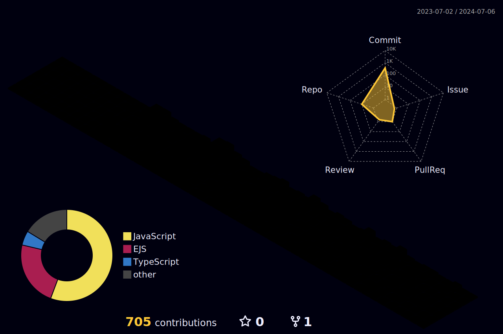

[](#)

<h3>👨‍💻&nbsp;About Me</h3>

- 🎓&nbsp;Bachelor Of Science In Computer Engineering
- 🙌&nbsp;Coding And Drinking Coffee Are My Happy
- 🏫&nbsp;I'm Learning NodeJS

<h3>⚙️&nbsp;Tech Stack</h3>

<div align = "center">
  

<br />

</div>

<h2>⚡️ &nbsp; Github Stats</h2>
<p align = "center">
  
  

</p>

<p align = "center">
  
</p>

<!--START_SECTION:waka-->


📊 **This Week I Spent My Time On** 

```text
💬 Programming Languages: 
TypeScript               11 hrs 1 min        ⣿⣿⣿⣿⣿⣿⣿⣿⣿⣿⣀⣀⣀⣀⣀⣀⣀⣀⣀⣀⣀⣀⣀⣀⣀   39.75 % 
JavaScript               9 hrs 2 mins        ⣿⣿⣿⣿⣿⣿⣿⣿⣀⣀⣀⣀⣀⣀⣀⣀⣀⣀⣀⣀⣀⣀⣀⣀⣀   32.60 % 
EJS                      5 hrs 24 mins       ⣿⣿⣿⣿⣿⣀⣀⣀⣀⣀⣀⣀⣀⣀⣀⣀⣀⣀⣀⣀⣀⣀⣀⣀⣀   19.48 % 
JSON                     1 hr 7 mins         ⣿⣀⣀⣀⣀⣀⣀⣀⣀⣀⣀⣀⣀⣀⣀⣀⣀⣀⣀⣀⣀⣀⣀⣀⣀   04.06 % 
Bash                     55 mins             ⣿⣀⣀⣀⣀⣀⣀⣀⣀⣀⣀⣀⣀⣀⣀⣀⣀⣀⣀⣀⣀⣀⣀⣀⣀   03.35 % 

🔥 Editors: 
VS Code                  27 hrs 44 mins      ⣿⣿⣿⣿⣿⣿⣿⣿⣿⣿⣿⣿⣿⣿⣿⣿⣿⣿⣿⣿⣿⣿⣿⣿⣿   100.00 % 

🐱‍💻 Projects: 
product-management-nodejs20 hrs 42 mins      ⣿⣿⣿⣿⣿⣿⣿⣿⣿⣿⣿⣿⣿⣿⣿⣿⣿⣿⣿⣀⣀⣀⣀⣀⣀   74.66 % 
club managment           5 hrs 48 mins       ⣿⣿⣿⣿⣿⣀⣀⣀⣀⣀⣀⣀⣀⣀⣀⣀⣀⣀⣀⣀⣀⣀⣀⣀⣀   20.91 % 
liara product            54 mins             ⣿⣀⣀⣀⣀⣀⣀⣀⣀⣀⣀⣀⣀⣀⣀⣀⣀⣀⣀⣀⣀⣀⣀⣀⣀   03.28 % 
database                 10 mins             ⣀⣀⣀⣀⣀⣀⣀⣀⣀⣀⣀⣀⣀⣀⣀⣀⣀⣀⣀⣀⣀⣀⣀⣀⣀   00.61 % 
73de73a4-8014-41f2-9043-72 mins              ⣀⣀⣀⣀⣀⣀⣀⣀⣀⣀⣀⣀⣀⣀⣀⣀⣀⣀⣀⣀⣀⣀⣀⣀⣀   00.17 % 

💻 Operating System: 
Windows                  27 hrs 44 mins      ⣿⣿⣿⣿⣿⣿⣿⣿⣿⣿⣿⣿⣿⣿⣿⣿⣿⣿⣿⣿⣿⣿⣿⣿⣿   100.00 % 
```

**I Mostly Code in JavaScript** 

```text
JavaScript               10 repos            ⣿⣿⣿⣿⣿⣿⣿⣿⣿⣿⣿⣿⣿⣿⣿⣿⣿⣿⣿⣿⣿⣀⣀⣀⣀   83.33 % 
EJS                      1 repo              ⣿⣿⣀⣀⣀⣀⣀⣀⣀⣀⣀⣀⣀⣀⣀⣀⣀⣀⣀⣀⣀⣀⣀⣀⣀   08.33 % 
TypeScript               1 repo              ⣿⣿⣀⣀⣀⣀⣀⣀⣀⣀⣀⣀⣀⣀⣀⣀⣀⣀⣀⣀⣀⣀⣀⣀⣀   08.33 % 
```


<!--END_SECTION:waka-->

  

